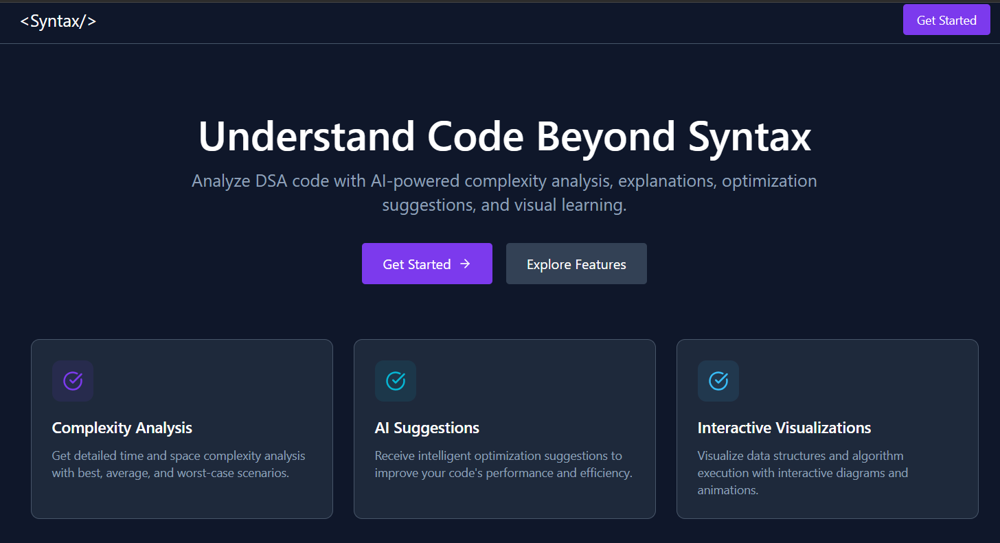
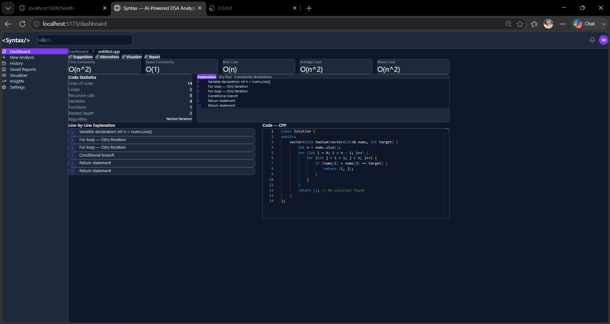
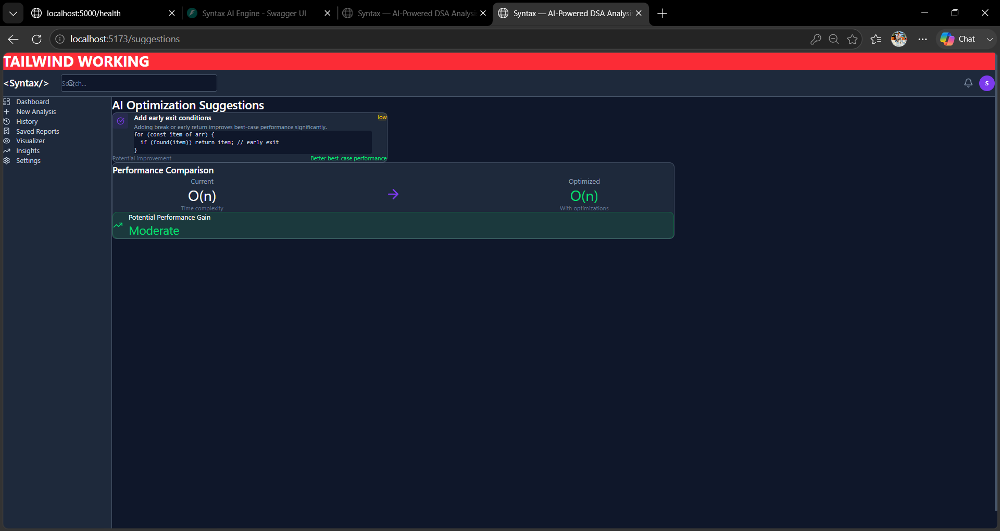
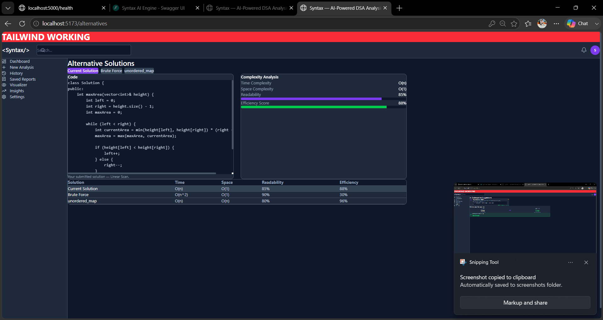
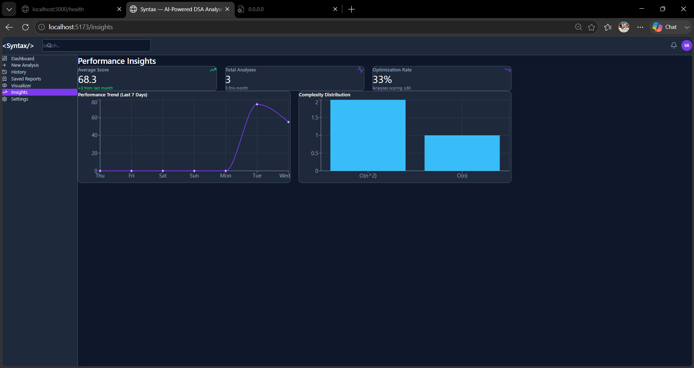
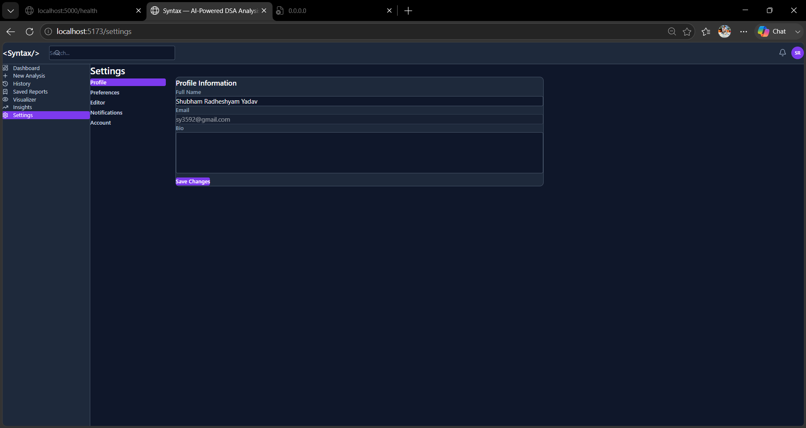

# Syntax - AI Powered Code Analysis Platform

## About Project

Syntax is a web-based platform that helps users analyze DSA code and understand its performance. It provides complexity analysis, optimization suggestions, visualizations, and report generation.

## Features

* User Authentication (JWT)
* Code Analysis
* Time and Space Complexity Detection
* Optimization Suggestions
* Data Structure Visualizations
* Analysis History
* PDF Report Generation
* Saved Reports
* Dashboard Insights

## 🖼️ Screenshots

### 🚀 Landing Page



---

### 📊 Analysis Dashboard



---

### 🤖 AI Suggestions



---

### 🔄 Alternative Solutions



---

### 📈 Performance Insights



---

### ⚙️ Settings Page



## Technologies Used

### Frontend

* React
* TypeScript
* Vite
* Tailwind CSS
* Zustand
* Monaco Editor

### Backend

* Node.js
* Express.js
* MongoDB
* JWT Authentication
* PDFKit

### AI Engine

* Python
* FastAPI
* AST Parsing

## Installation

### Backend

```bash
cd backend
npm install
npm run dev
```

### Frontend

```bash
cd frontend
npm install
npm run dev
```

### AI Engine

```bash
cd ai-engine
python -m venv venv

# Windows
venv\Scripts\activate

pip install -r requirements.txt
python main.py
```

## Environment Variables

### Backend

```env
PORT=5000
MONGODB_URI=mongodb://localhost:27017/syntax_db
JWT_SECRET=your_secret_key
AI_ENGINE_URL=http://localhost:8000
```

### Frontend

```env
VITE_API_URL=http://localhost:5000/api/v1
```

## Project Structure

```text
frontend/
backend/
ai-engine/
```

## Future Improvements

* More programming language support
* Advanced visualizations
* Better AI recommendations
* Team collaboration features

## Author

Shubham Yadav

